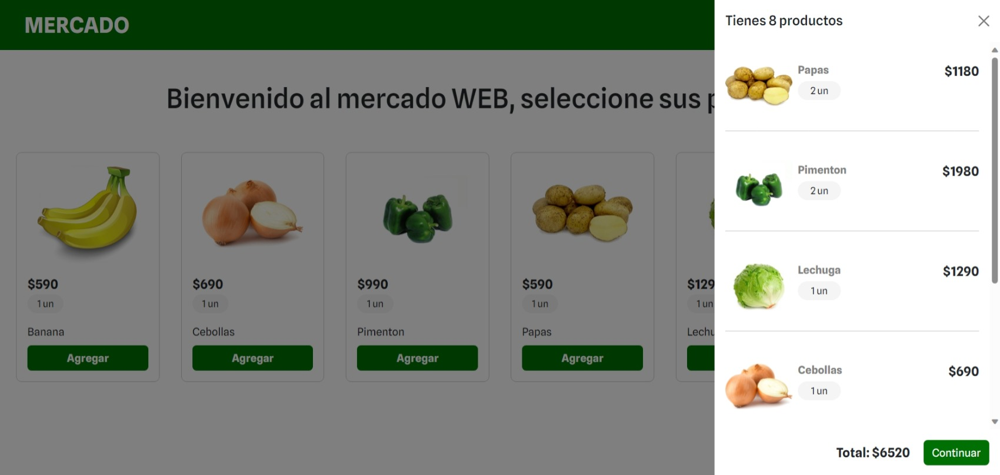
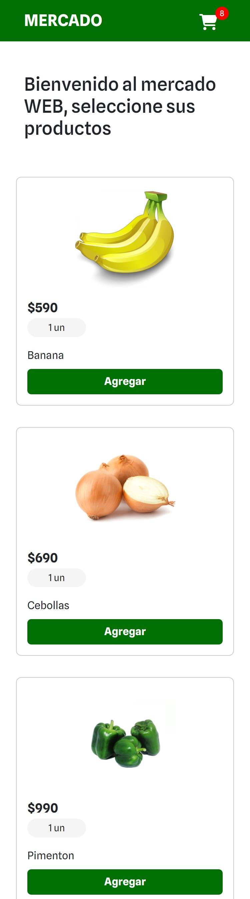

# Desafío Mercado Web

## Descripción
Desarrollo de una aplicación web para el Mini Market "Come Sano, Come Fresco Spa", que permite la venta de alimentos online. Se utiliza Express.js en el lado del servidor para manejar las solicitudes HTTP y renderizar vistas dinámicas utilizando Handlebars. Para el front-end, se emplean HTML, CSS, JavaScript, Bootstrap y jQuery para proporcionar una experiencia de usuario interactiva y atractiva.

## Funcionalidades
| Funcionalidades                           | Descripción                                                                                                                    |
|-------------------------------------------|--------------------------------------------------------------------------------------------------------------------------------|
| **Agregar Productos**                     | Permite a los usuarios agregar productos al carrito de compras haciendo clic en el botón "Agregar".                         |
| **Visualización del Carrito**             | Al hacer clic en el icono del carrito, se muestra un modal con los productos agregados, incluyendo imagen, nombre y precio. |
| **Actualización Automática del Carrito**  | El contador de productos en el icono del carrito se actualiza automáticamente al agregar un producto.                      |
| **Interfaz Responsiva**                   | La aplicación se adapta a diferentes dispositivos y tamaños de pantalla para una experiencia de usuario óptima.            |

## Herramientas usadas
### Front-end
- HTML
- CSS
- JavaScript
- Bootstrap
### Back-end
- Node.js
- Express.js
- Handlebars

## Instalación y ejecución
- Clona o descarga el repositorio.
- Asegúrate de tener instalado Node.js en tu sistema.
- Ejecuta npm install para instalar las dependencias.
- Ejecuta el servidor con node --watch index.js o npm run dev.
- Accede a la aplicación en tu navegador a través de la dirección http://localhost:3000.